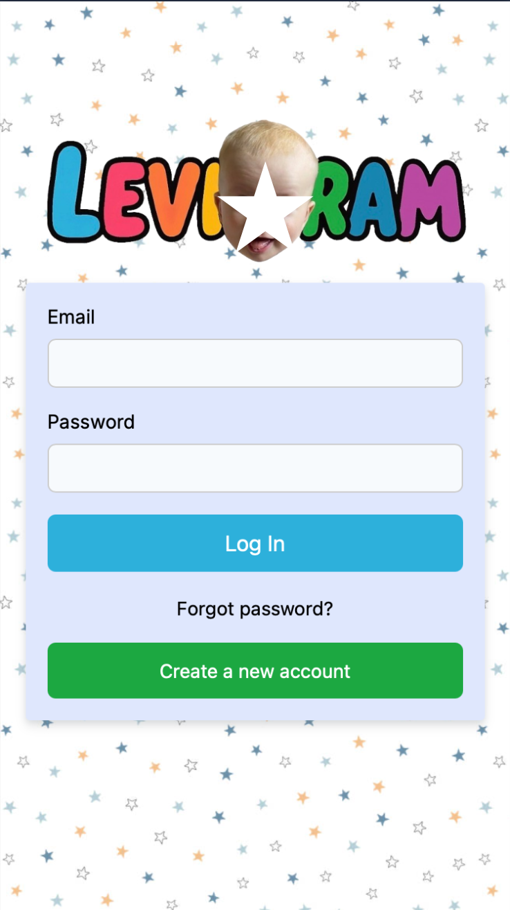
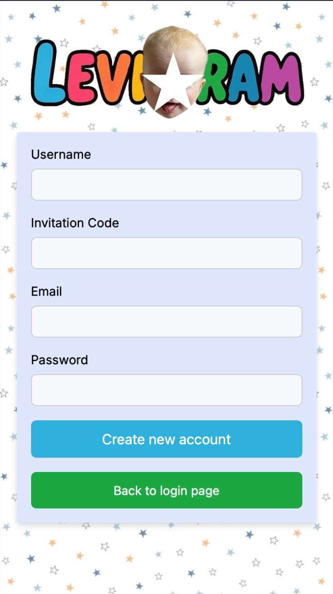
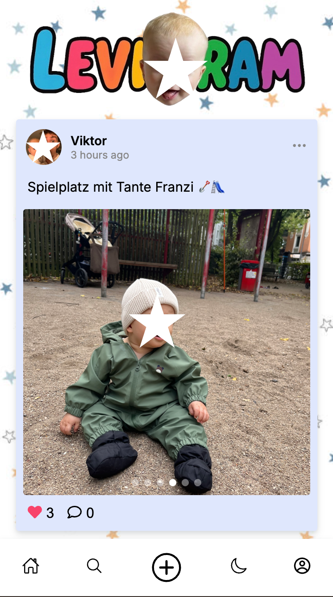
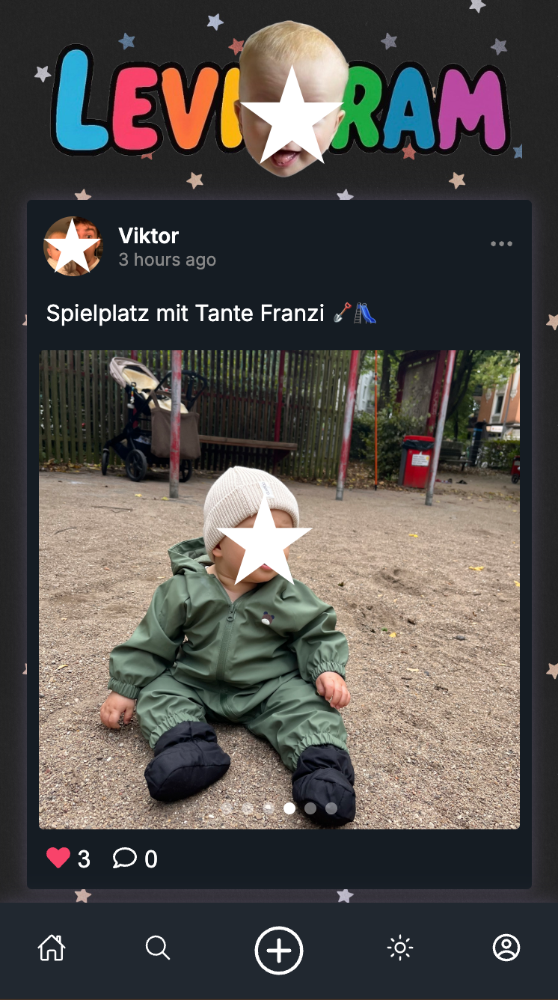
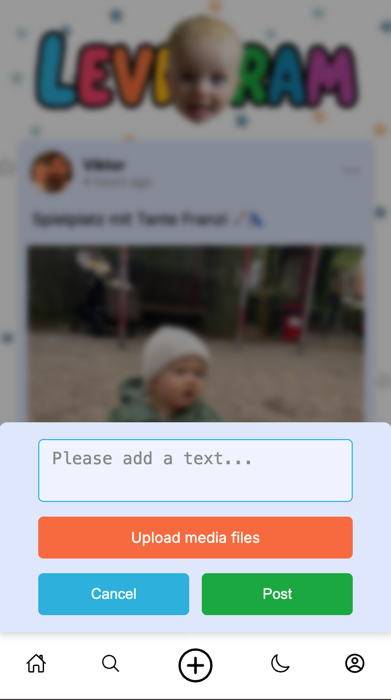
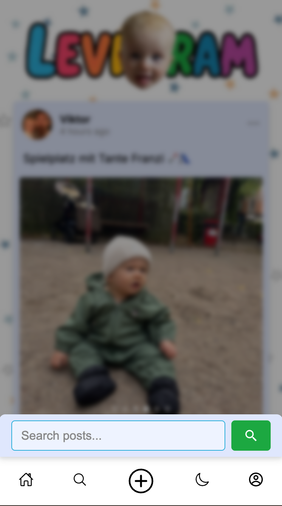

# Levigram – Private Family Social App 👨‍👩‍👧‍👦✨

Levigram is a **private social media app** for family & close friends.  
It creates a safe space to share posts, pictures, and memories, only accessible via invitation.

---

## 🚀 Features

- 📝 **Create posts** – Share text, images & videos with family & friends
- ❤️ **Likes & comments** – Comment on posts and like/unlike them
- 🔔 **Push notifications** – Get notified instantly when something new is posted (PWA, iOS & Android supported)
- 🌙 **Dark / Light mode** – Auto or manual switch
- 🔎 **Search posts** – Search for specific events or dates
- 📱 **PWA (Progressive Web App)** – Install it like a native app
- 👤 **Profiles & avatars** – Personal user accounts
- 🔒 **Invitation code system** – Only invited users can join

---

## 📸 Screenshots

### 🔑 Login Page

  

---

### 📝 Create Account Page

  

---

### 🏠 Landing Page

  
  

---

### ➕ Create Post Page

  

---

### 👤 Profile Page

  

---

### 🔍 Search Page

  

---

## 🛠 Tech Stack

**Frontend:**

- React + TypeScript
- Redux Toolkit
- React Router
- SCSS Modules
- Vite (build tool)

**Backend:**

- Node.js + Express
- MongoDB + Mongoose
- JWT & Cookie-based Authentication
- Web Push API

**Other:**

- Cloudinary (media hosting)
- Render (deployment)

Find the backend here: ([Levigram_BE](https://github.com/ViktorPisarczyk/Levigram_BE))

---
